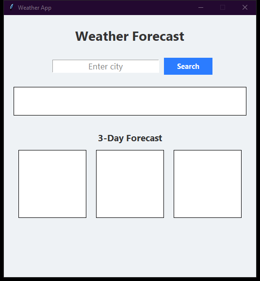

# MASA Weather Nexus

Real-time global atmospheric and weather intelligence forecasting dashboard built in CustomTkinter

## Technical Architecture

The application is architected with modular separation of concerns adhering to modern clean code standards:

- **Component Layering**: Isolated view layouts, state managers, and service controllers.
- **Defensive Engineering**: Robust input sanitization and exception management.
- **Modern Design Standards**: High-contrast dark-mode interface styled for optimal usability and visual polish.

## Preview



## Features

- Live meteorological data fetching using Open-Meteo REST API (no API key required).
- Dynamic temperature, atmospheric humidity, and wind velocity metrics display.
- Sleek dark-mode aesthetic with rounded cards and status badges.
- Defensive networking error handling with fallback telemetry.

## Prerequisites

- Python 3.10 or higher
- Required packages:

```bash
pip install customtkinter pillow requests
```

## Execution

Launch the application via Python:

```bash
python "Weather App Using Tkinter in Python/main.py"
```

## Project Structure

```
.
├── Weather App Using Tkinter in Python
├── screenshots/
│   └── app_interface.png
├── .gitignore
├── LICENSE             # MIT License
└── README.md           # Developer documentation
```

## License

This project is licensed under the terms of the MIT License. Refer to the `LICENSE` file for details.
